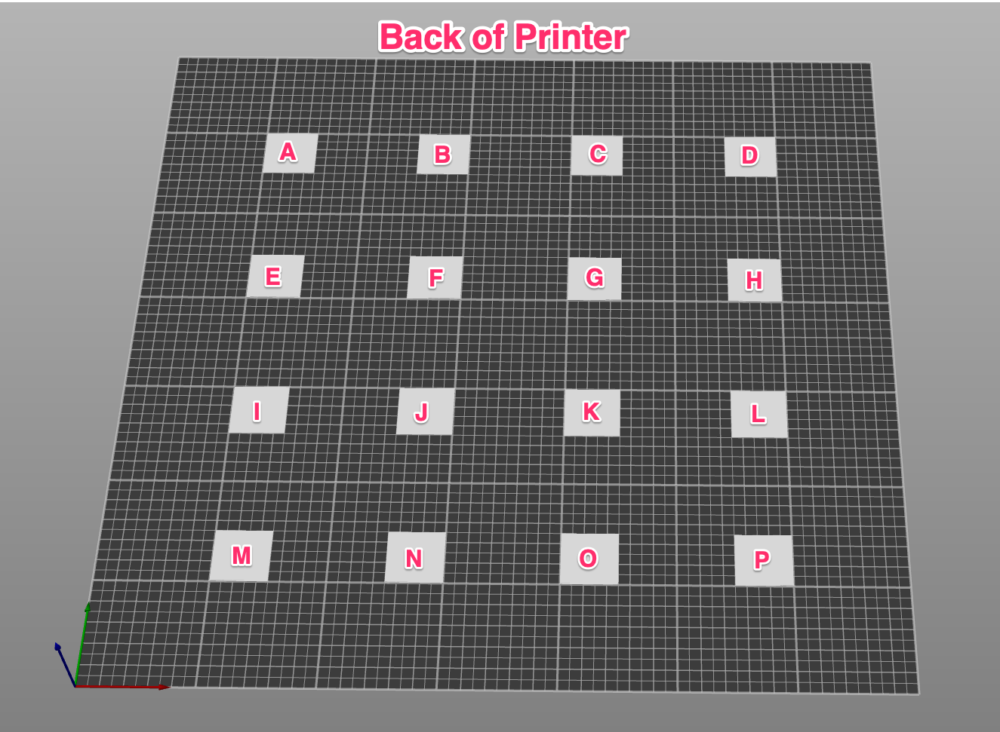

# First Layer Squish Patches v1

A set of 16x of Andrew Ellis's [0.25mm First Layer Patch](https://github.com/AndrewEllis93/Print-Tuning-Guide/blob/main/test_prints/first_layer_patches/First_Layer_Patch-0.25mm.stl), each with a 0.01 mm offset from the previous to help automate some of the calibration suggested in [Ellis' Print Tuning Guide - First Layer Squish](https://ellis3dp.com/Print-Tuning-Guide/articles/first_layer_squish.html).

## Key Points

- GCODE files due to slicer limitations
- 16 tiles per set
- Each tile has a 0.01 change in z offset from the previous
- Designed for a Voron v2.4 with 350mmx350mm bed and CNC Voron Tap
- Printing with 70c bed and 235c hotend (calibrated for Polymaker Pro PLA)

## GCODE

Ideally these would be delivered in a more flexible format but since the patches are all done as a single layer and there is not an easy way to inject gcode between each object, the files are created as GCODE.

## Patch Set Layout

`BACK OF PRINTER BED`

| `A` | `B` | `C` | `D` |
| :-: | :-: | :-: | :-: |
| `E` | `F` | `G` | `H` |
| `I` | `J` | `K` | `L` |
| `M` | `N` | `O` | `P` |

`FRONT OF PRINTER BED`

## Patch Sets

| Patch | ID  | `Patch Set 01` Z Offset | `Patch Set 02` Z Offset | `Patch Set 03` Z Offset | `Patch Set 04` Z Offset |
| ----- | --- | ----------------------- | ----------------------- | ----------------------- | ----------------------- |
| A     | 1   | -0.00                   | -0.14                   | 0.00                    | 0.14                    |
| B     | 2   | -0.01                   | -0.15                   | 0.01                    | 0.15                    |
| C     | 3   | -0.02                   | -0.16                   | 0.02                    | 0.16                    |
| D     | 4   | -0.03                   | -0.17                   | 0.03                    | 0.17                    |
| E     | 5   | -0.04                   | -0.18                   | 0.04                    | 0.18                    |
| F     | 5   | -0.05                   | -0.19                   | 0.05                    | 0.19                    |
| G     | 6   | -0.06                   | -0.20                   | 0.06                    | 0.20                    |
| H     | 7   | -0.07                   | -0.21                   | 0.07                    | 0.21                    |
| I     | 8   | -0.08                   | -0.22                   | 0.08                    | 0.22                    |
| J     | 9   | -0.09                   | -0.23                   | 0.09                    | 0.23                    |
| K     | 10  | -0.10                   | -0.24                   | 0.10                    | 0.24                    |
| L     | 11  | -0.11                   | -0.25                   | 0.11                    | 0.25                    |
| M     | 12  | -0.12                   | -0.26                   | 0.12                    | 0.26                    |
| N     | 13  | -0.13                   | -0.27                   | 0.13                    | 0.27                    |
| O     | 14  | -0.14                   | -0.28                   | 0.14                    | 0.28                    |
| P     | 15  | -0.15                   | -0.29                   | 0.15                    | 0.29                    |
